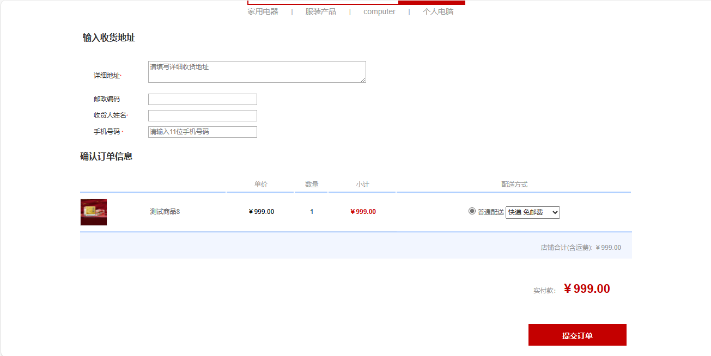

<h1 align="center">34.基于ssm电子商务商城管理系统</h1>

 获取sql文件 QQ: 386869957 QQ群: 377586148 

 [推荐站点: 从戎源码网](https://armycodes.com/) 

## 简介

> 本代码来源于网络,仅供学习参考使用!
> 
> 前台地址：http://localhost:8080/fore/foreHome
> 用户名：Tom 密码：123
> 
> 管理后台地址：http://localhost:8080/admin/adminLogin
> 用户名：admin 密码：123456
>

## 项目介绍

基于ssm电子商务商城管理系统：前端 jsp、bootstrap、jquery，后端 spring、mybatis，系统角色分为用户和管理员，系统集成分类管理、商品管理、会员管理、订单管理、积分管理、商品浏览、购物车和在线支付等功能。

## 主要功能

### 用户

- 基本功能：登录、注册、退出、个人信息查看
- 商品购买：商品分类展示、首页轮播图、商品详情、立即购买、加入购物车、购物车列表、购物车结算、购物车商品删除
- 我的订单：订单列表、所有订单、待付款、待发货、待收货、已完成、催卖家发货、订单删除

### 管理员

- 基本功能：登录、退出、我的桌面、系统信息、开发环境信息展示
- 分类管理：分类列表、添加分类、分类信息编辑、分类信息删除
- 属性管理：属性列表、新增属性、属性编辑、属性删除
- 商品管理：商品列表、添加商品、商品图片上传修改、商品信息编辑、商品删除
- 会员管理：会员列表、会员信息删除
- 订单管理：订单列表、查看订单详情、订单发货
- 积分管理：积分列表、积分排行榜、积分规则
- 系统管理：添加用户、用户列表、用户删除、搜索用户

## 环境

- <b>IntelliJ IDEA</b>

- <b>Mysql 5.7</b>

- <b>Tomcat 9.x</b>

- <b>JDK 1.8</b>

## 运行截图

